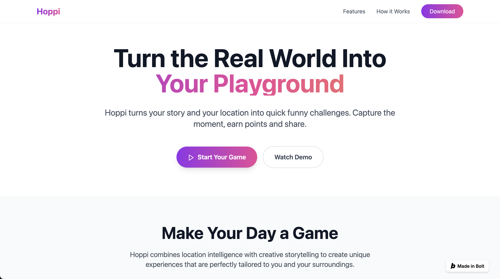

# Hoppi
AI-powered app that turns the real world into your playground!

<p align="center">
  
  <span style="display:inline-block; width:60px;"></span>
  
</p>

## ✨ What is Hoppi?
Hoppi encourages people to:
- 🌍 Go outside and interact with real places  
- 🤝 Connect with strangers through light, safe, fun tasks  
- 📸 Create and share quirky memories instantly  

## 🚀 Features
- 🌍 **Location Detection** → Geolocation + Overpass API + geopy  
- 🤖 **Task Generation** → AI-powered prompts (LLM via Ollama)  
- 📸 **Capture Moments** → Camera / mic input (getUserMedia or Streamlit WebRTC)  
- 🎨 **Fun Frames & Points** → Image & video edits with Pillow, OpenCV, MoviePy  
- 🗄️ **Storage & Analysis** → SQLite or Supabase, analytics with PostHog  
- 🚀 **Output & Sharing** → Save locally or share instantly  

## ⚡ Quick Start

### Prerequisites
- Python 3.10+  
- Git installed  
- (Optional) [Ollama](https://ollama.ai) for local LLM tasks  

### Installation
```bash
# Clone this repository
git clone git@github.com:kl-sin/Hoppi.git

# Navigate into the project
cd Hoppi

# (Optional) Set up virtual environment
python3 -m venv venv
source venv/bin/activate   # macOS/Linux
venv\Scripts\activate      # Windows

# Install dependencies (when requirements.txt is available)
pip install -r requirements.txt
```

### Running the App
```bash
# Run the Flask application
python app.py
```

Then open your browser and go to `http://localhost:5000`

## 📱 Mobile App

For the best experience on mobile devices, we also have a React Native mobile app!

### Quick Setup:
```bash
# Navigate to mobile directory
cd mobile

# Run setup script
./setup.sh

# For Android
npm run android

# For iOS (Mac only)
npm run ios
```

### Mobile Features:
- 📍 **Native GPS** - Works reliably on mobile devices
- 📸 **Camera Integration** - Take photos, videos, and record audio
- 🎯 **Location-based Tasks** - Same creative tasks as web version
- 📱 **Offline Ready** - Works without internet connection
- 🎨 **Beautiful UI** - Optimized for mobile screens

### Building APK for Android:
```bash
cd mobile/android
./gradlew assembleRelease
# APK will be in app/build/outputs/apk/release/
```