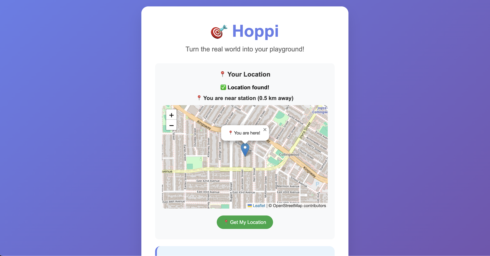

# Hoppi
**Hoppi** is a playful web app that turns the real world into your adventure playground! 🌍🎯  

🔗 **Live Demo:** [Try Hoppi here](https://huggingface.co/spaces/klsin/Hoppi)  

<p align="left">
  
</p>

---

## ✨ What is Hoppi?
Hoppi encourages people to:
- 🌍 Explore outside and interact with real places  
- 🤝 Connect with strangers through light, safe, fun tasks  
- 📸 Capture and share quirky memories instantly  

---

## 🚀 Features
- 🗺️ **Interactive Map** – Live geolocation shown with Leaflet.js  
- 📍 **Nearby Detection** – Uses the Overpass API to suggest location type (park, restaurant, street, beach, mall)  
- 🎯 **Task Generator** – Flask backend serves fun challenges based on detected location  
- 📸 **Media Capture** – Take photos, record video, or audio directly in the browser  
- 💾 **File Upload/Download** – Save or retrieve captured files via Flask routes  

---

## ⚡ Quick Start

### Prerequisites
- Python **3.10+**  
- Git installed  

### Installation
```bash
# Clone this repository
git clone git@github.com:kl-sin/Hoppi.git

# Navigate into the project
cd Hoppi

# (Optional) Create a virtual environment
python3 -m venv venv
source venv/bin/activate   # macOS/Linux
venv\Scripts\activate      # Windows

# Install dependencies
pip install -r requirements.txt
````

### Running the App

```bash
# Start Flask backend
python app.py
```

Then open your browser and go to:
👉 `http://localhost:8000`

---

## 🛠️ Tech Stack

* **Backend:** Flask (Python)
* **Frontend:** HTML, CSS, JavaScript (Leaflet.js for maps)
* **Media Handling:** HTML5 getUserMedia API + Flask file upload/download
* **Location Data:** Browser Geolocation API + Overpass API

---

## 🎯 Roadmap

* [ ] Add user points & leaderboard
* [ ] Enhance task generation with AI/LLM prompts
* [ ] Add filters/effects to media with Pillow/OpenCV
* [ ] Store user submissions in a database (SQLite or Supabase)
* [ ] Improve UI/UX for smoother mobile browser experience

```
