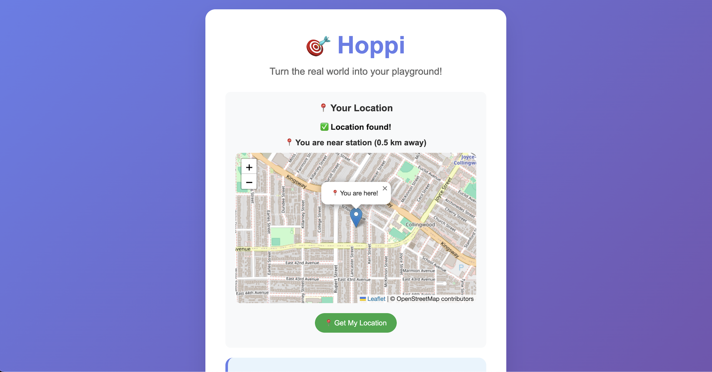

# Hoppi
**Hoppi** is a playful, AI-powered web app that turns the real world into your adventure playground. 🌍🎯

It reads where you are, what the weather's doing, and the time of day, then an LLM hands you a tiny, doable, one-action challenge. Capture it (photo, clip, audio, or a note), and Hoppi — a witty AI judge — reacts. Complete a few and Hoppi stitches your moments into an illustrated micro-story.

🔗 **Live Demo:** [Try Hoppi on Hugging Face Spaces](https://huggingface.co/spaces/klsin/Hoppi)
🎥 **Watch the Demo:** [Hoppi on YouTube](https://youtu.be/bX8YQ3l40y0)

<p align="left">
  
</p>

---

## ✨ What is Hoppi?
Hoppi encourages people to:
- 🌍 Explore outside and interact with real places
- 🤝 Connect with strangers through light, safe, fun tasks
- 📸 Capture and share quirky memories instantly
- 📖 Watch their small moments become a short, illustrated story

---

## 🚀 Features

### 🤖 AI-Generated Challenges
- **Context-aware task generator** — an LLM (via [Together AI](https://www.together.ai/)) writes a fresh 25–30 word challenge tuned to your **location type**, **nearby places**, **weather**, and **time of day**.
- **Environmental awareness** — combines:
  - 🌅 Sun cycle (Sunrise–Sunset API) → pre-dawn / morning / afternoon / evening / night
  - 🌦️ Weather (Open-Meteo) → clear, rainy, foggy, snowy, stormy hints
  - 🗺️ Reverse geocoding (Nominatim) → park, beach, restaurant, mall, street
  - 📍 Nearby points of interest (Overpass API)
- **Safety-aware** — softer, calmer, more private tasks when it's dark.

### 🎭 Hoppi the AI Judge
- After you submit, a multimodal judge model (**Gemma 3n** via Together) reacts to what you *actually* did — witty, specific, a little cheeky — instead of generic praise.
- **Media understanding** — image captioning (BLIP) and audio transcription (Whisper) feed the judge real context.
- Returns concise feedback (and an optional fit score) per submission.

### 📖 Illustrated Micro-Narratives
- After **3 submissions**, Hoppi weaves them into a short (<60 word) micro-story.
- Generates **3 AI illustrations** (one per story beat) with **FLUX.1-schnell**, served back to the browser.
- Detects whether your moments are thematically related and adapts the storytelling accordingly.

### 📸 Capture & Progress
- 🗺️ **Interactive map** with live geolocation (Leaflet.js)
- 📷 **In-browser media capture** — photos, video, and audio via the HTML5 `getUserMedia` API
- 💾 **Upload/download** of captured files through Flask routes
- 🎯 **Session progress** — collect 5 submissions to unlock a surprise
- 👍👎 **Feedback logging** — thumbs up/down on generated tasks, exported for review/QA

---

## 🛠️ Tech Stack

| Layer | Tools |
|-------|-------|
| **Backend** | Flask (Python) |
| **Frontend** | HTML, CSS, JavaScript, Leaflet.js |
| **LLMs** | Together AI — `openai/gpt-oss-20b` (tasks & stories), `google/gemma-3n-E4B-it` (judge) |
| **Image generation** | `black-forest-labs/FLUX.1-schnell` |
| **Media understanding** | Hugging Face BLIP (captioning), OpenAI Whisper (transcription) |
| **Location & context** | Browser Geolocation, Nominatim, Overpass, Open-Meteo, Sunrise–Sunset |
| **Media handling** | HTML5 `getUserMedia` + Flask file upload/download |

---

## ⚡ Quick Start

### Prerequisites
- Python **3.10+**
- Git
- A [Together AI](https://www.together.ai/) API key (required for AI features)
- *(Optional)* OpenAI and Hugging Face keys for audio transcription / image captioning

### Installation
```bash
# Clone this repository
git clone git@github.com:kl-sin/Hoppi.git
cd Hoppi

# Create and activate a virtual environment
python3 -m venv .venv
source .venv/bin/activate    # macOS/Linux
.venv\Scripts\activate       # Windows

# Install dependencies
pip install -r requirements.txt
```

### Configuration
Create a `.env` file in the project root:
```bash
TOGETHER_API_KEY=your_together_key_here
OPENAI_API_KEY=your_openai_key_here     # optional — audio transcription
HF_API_KEY=your_huggingface_key_here    # optional — image captioning
```

> ⚠️ Never commit `.env` — it's already in `.gitignore`. If a key is ever exposed, rotate it.

### Running the App
```bash
python app.py
```
Then open 👉 `http://localhost:8000`

> On Hugging Face Spaces the app writes to `/tmp` and reads the `PORT` env var automatically — no extra config needed.

---

## 🌐 API Routes

| Route | Method | Purpose |
|-------|--------|---------|
| `/` | GET | Main app (map + challenge UI) |
| `/generate-task` | POST | Generate a context-aware challenge from `latitude`/`longitude` |
| `/submit` | POST | Submit media/text, get judge feedback, trigger micro-narrative |
| `/feedback` | POST | Log a 👍/👎 rating on a generated task |
| `/feedback-logs` | GET | Browse logged feedback |
| `/progress/<session_id>` | GET | Submission count & surprise-ready status |
| `/download/<filename>` | GET | Retrieve an uploaded or generated file |

---

## 📂 Project Structure
```
Hoppi/
├── app.py              # Flask server & routes
├── gentask.py          # LLM task generation (Together)
├── judge.py            # Hoppi the AI judge (Gemma 3n) + media summarization
├── micronarrative.py   # 3-submission story + image generation (FLUX)
├── templates/          # index.html (frontend)
├── assets/             # Logos & screenshots
├── uploads/            # Captured media (sessions)
├── outputs/ results/   # Feedback logs & debug prompts
├── tests/              # Test suite
└── requirements.txt
```

---

## 🎯 Roadmap
- [ ] User points & leaderboard
- [ ] Video understanding for the judge
- [ ] Persist submissions in a database (SQLite or Supabase)
- [ ] Richer micro-narrative styles & shareable story cards
- [ ] Smoother mobile-browser UX

---

© Sinko
